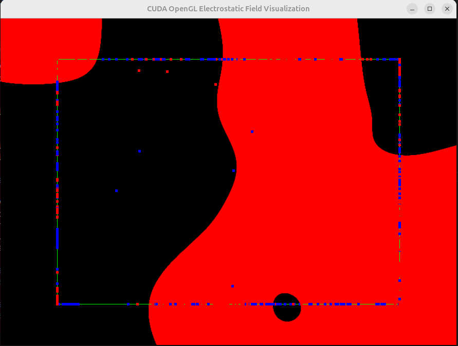
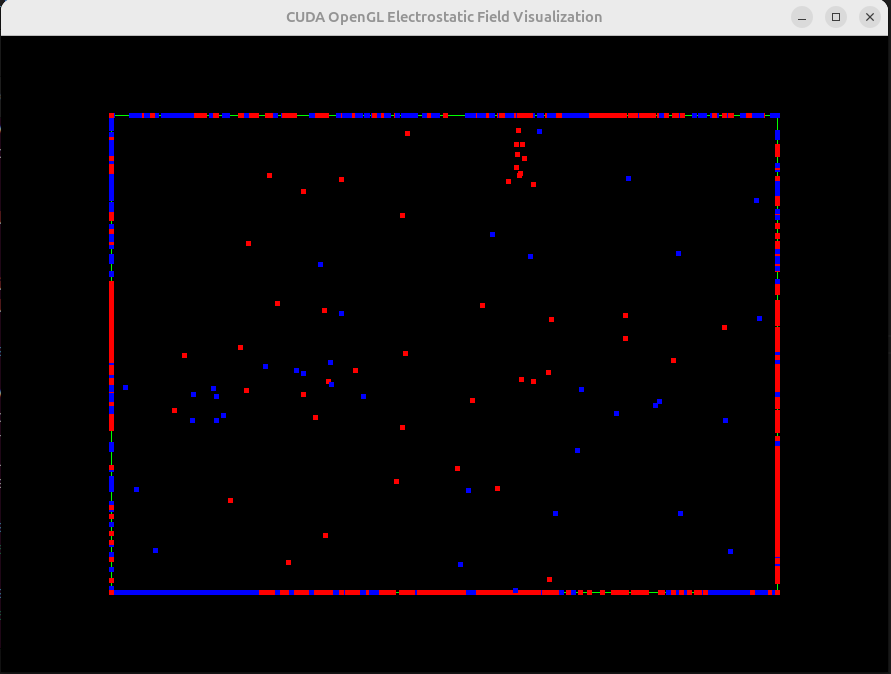

# CUDA-Accelerated Electrostatic Field Simulation

[](LICENSE)
[](https://developer.nvidia.com/cuda-toolkit)
[](https://www.opengl.org/)
[](https://www.linux.org/)

## Table of Contents
- [CUDA-Accelerated Electrostatic Field Simulation](#cuda-accelerated-electrostatic-field-simulation)
  - [Table of Contents](#table-of-contents)
  - [Project Overview](#project-overview)
  - [Theory](#theory)
    - [Electrostatics](#electrostatics)
    - [Particle Dynamics](#particle-dynamics)
    - [Visualization](#visualization)
  - [Goals and Objectives](#goals-and-objectives)
  - [Implementation Details](#implementation-details)
    - [1. **CUDA Kernels**](#1-cuda-kernels)
    - [2. **OpenGL Rendering**](#2-opengl-rendering)
    - [3. **User Controls**](#3-user-controls)
    - [4. **Performance Optimization**](#4-performance-optimization)
  - [Features](#features)
  - [Controls](#controls)
  - [Building the Project](#building-the-project)
    - [Prerequisites](#prerequisites)
    - [Instructions](#instructions)
    - [Dependencies](#dependencies)
  - [Running the Simulation](#running-the-simulation)
  - [Future Work](#future-work)
  - [License](#license)
  - [Contact \& Contributions](#contact--contributions)

---

## Project Overview
This project implements a CUDA-accelerated simulation of an electrostatic field with visualized particles (protons and electrons) in a 2D space. The simulation is capable of displaying the electrostatic field, showing particle interactions, and visualizing these in real time at 30 FPS or higher. The project leverages both CUDA for computation and OpenGL for rendering, creating a highly efficient, visually dynamic simulation.

---

## Theory
### Electrostatics
Electrostatics is the study of electric charges at rest. According to Coulomb's law, the electrostatic force \( F \) between two charges \( q_1 \) and \( q_2 \) is proportional to the product of the charges and inversely proportional to the square of the distance \( r \) between them:
\[
F = k_e \frac{q_1 q_2}{r^2}
\]
where \( k_e \) is Coulomb's constant. This force is used to compute the interactions between particles in the simulation.

### Particle Dynamics
The particles in the simulation are randomly initialized as either protons (+) or electrons (-). Each particle experiences a force based on Coulomb's law, resulting in movement across the 2D field. Particles are restricted to remain within a bounding box that is smaller than the window, simulating a confined space.

### Visualization
The electrostatic field is visualized using a color gradient, where:
- **Red** represents the positive intensity of the field.
- **Blue** represents the negative intensity of the field.
The particles are shown as dots, with protons in red and electrons in blue. Field intensity is also scaled, allowing the user to observe the field's spatial distribution in real time.

Examples of the visualization are shown below:

- **Field visualization**



- **Particle Dynamics**



---

## Goals and Objectives
The primary goals of this project are:
1. **Simulate an Electrostatic Field**: Use CUDA to calculate electrostatic forces between particles, generating a dynamic and accurate field representation.
2. **Real-time Visualization**: Leverage OpenGL to render the field and particles at interactive frame rates (30+ FPS).
3. **Interactivity**: Allow users to control various aspects of the simulation, including toggling the field display, adjusting simulation speed, and changing the field intensity.
4. **Efficiency**: Maximize computational performance using parallel processing in CUDA, making the simulation efficient enough for real-time interaction.

---

## Implementation Details
The implementation comprises the following main components:

### 1. **CUDA Kernels**
   - **Field Calculation**: Computes the electrostatic field value for each pixel in the window based on the positions and charges of all particles.
   - **Particle Dynamics**: Updates the positions and velocities of each particle, considering interactions with other particles and reflecting off the bounding box edges.

### 2. **OpenGL Rendering**
   - **Field Visualization**: Uses OpenGL textures to display the electrostatic field as a heatmap.
   - **Particle Rendering**: Renders particles with different colors and sizes depending on their charge, distinguishing between protons and electrons.

### 3. **User Controls**
   - The project includes keyboard controls to adjust the simulation speed, intensity of the field visualization, and the option to toggle the field on or off.

### 4. **Performance Optimization**
   - The Structure of Arrays (SoA) approach is used for particle data to optimize memory access patterns, reducing memory access latency and improving parallelism.
   - Shared memory is leveraged to reduce global memory access within CUDA kernels, increasing computational efficiency.

---

## Features
- **Toggleable Field Visualization**: Users can toggle the electrostatic field visualization on or off.
- **Adjustable Simulation Speed**: Speed up or slow down the simulation with keyboard controls.
- **Dynamic Field Intensity**: Adjust the intensity scale of the field to enhance visualization.
- **Interactive and Real-time**: Control the simulation with an interactive keyboard interface, rendered in real-time with OpenGL.
- **Bounded Simulation Space**: Particles are confined within a box that is 3/4 the size of the window, creating a sense of spatial restriction.

---

## Controls
| Key  | Function                         |
|------|----------------------------------|
| **p**  | Pause/unpause the simulation      |
| **f**  | Toggle field visualization on/off |
| **+**  | Increase simulation speed         |
| **-**  | Decrease simulation speed         |
| **i**  | Increase field intensity          |
| **d**  | Decrease field intensity          |

---

## Building the Project

### Prerequisites
- **CUDA Toolkit** (v12.0 or higher)
- **OpenGL** (v4.5 or higher)
- **GLEW** and **GLUT** libraries
- **g++** compiler

### Instructions
Clone the repository and navigate into the project directory:

```bash
git clone https://github.com/yourusername/electrostatic-simulation.git
cd electrostatic-simulation
```

Then, build the project using `make`:
```bash
make
```

### Dependencies
This project requires the following dependencies, which can be installed on Ubuntu using:
```bash
sudo apt update
sudo apt install build-essential freeglut3 freeglut3-dev libglew-dev mesa-utils
```

WARNING: On some distributions freeGLUT may not be installable via apt. In this case, you can download the source code from the [freeGLUT website](http://freeglut.sourceforge.net/) and build it manually.

---

## Running the Simulation

Once the project is built, you can run the simulation with:
```bash
./bin/electrostatic_simulation
```

Observe the particles and electrostatic field in real time, and use the keyboard controls to interact with the simulation.

---

## Future Work
Future enhancements for this project could include:
- **Additional Particle Types**: Adding other charged particles for more complex interactions.
- **3D Visualization**: Extending the simulation to three dimensions, leveraging CUDA for 3D computations and OpenGL for 3D rendering.
- **Performance Optimization**: Further tuning using advanced CUDA features such as asynchronous memory transfers and streams.
- **Physics Extensions**: Adding gravitational forces or other physical phenomena to explore multi-force particle dynamics.
  
---

## License
This project is licensed under the MIT License - see the [LICENSE](LICENSE) file for details.

---

## Contact & Contributions
Contributions are welcome! Feel free to fork the project, submit issues, or make pull requests to improve the code.